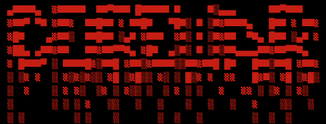
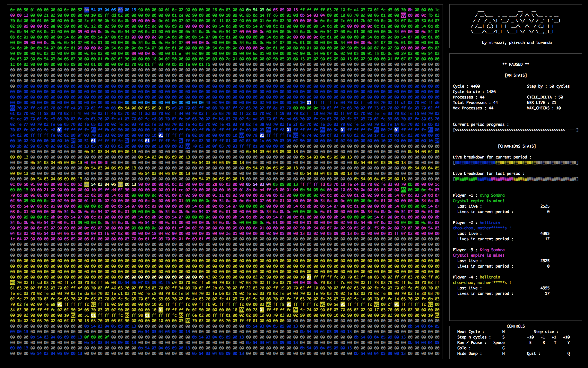

COREWAR
===

Subject : https://github.com/mtrazzi/corewar/blob/master/resources/documents/corewar.en.pdf

## Getting started

- change current directory to the root of the repository
- make (compiles our libraries and produces ./asm and ./corewar)
- sh resources/scripts/compile.sh (compiles everything with our compiler )

## Execution in Ncurse

